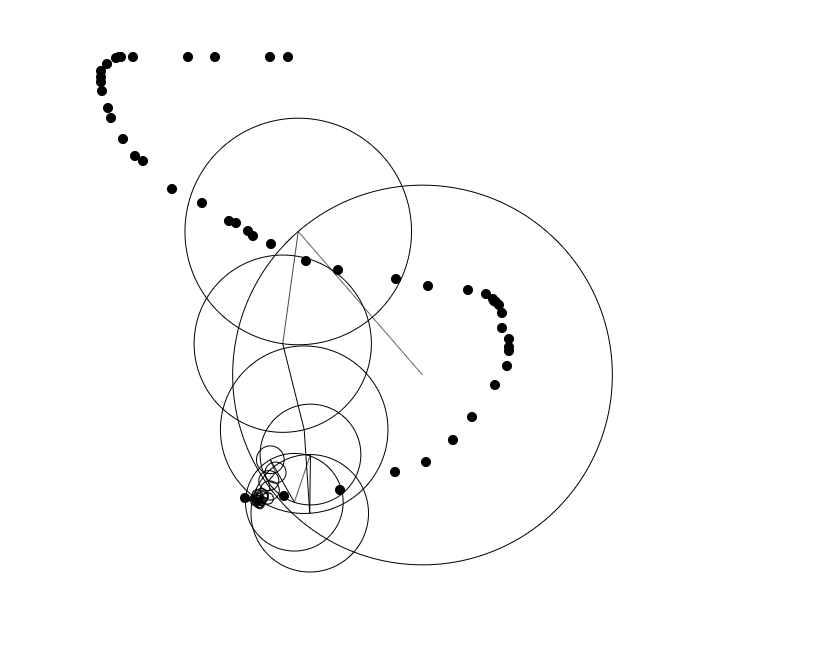

# Product Name
> Short blurb about what it does and how it works.



## Installation

It's as simple as just downloading the repo and running the index.html in your favorite Browser. Done

## Usage example

You can use the different given examples to get a better imagination of the Fourier transformation or Fourier series.

## Development setup

To work with this Code just download this repo or clone it to your GitHub Desktop and have fun manipulating the JavaScript. <br/>
In addition you could embed it in your Website for educational purposes or just as an example. <br/>
There is nothing more than a simple TextEditor needed to work with this Code.

Atom:
```sh
cd C:\Path\to\your\directory
atom .
```

## Release History

* 0.0.1
    * ADD: Add Fourier Series
* 0.0.2
    * CHANGE: Improve Fourier Series graphing
    * ADD: Add Fourier transformation
* 0.0.3
    * ADD: Add Fourier transformation in 2 Dimensions
* 0.0.4
    * ADD: Add Fourier transformation in 2 Dimensions with user drawing
    * ADD: Add Fourier transformation in 2 Dimensions with one EpiCycle System and user drawing
* 0.1.0
    * First release

## Meta

See on GitHub Pages []()

Distributed under the MIT license. See ``LICENSE`` for more information.

[github.com/niclasrst/Fourier](https://github.com/niclasrst/Fourier)

## Contributing

1. Fork it (<https://github.com/niclasrst/Fourier/fork>)
2. Create your feature branch (`git checkout -b feature/fooBar`)
3. Commit your changes (`git commit -am 'Add some fooBar'`)
4. Push to the branch (`git push origin feature/fooBar`)
5. Create a new Pull Request
